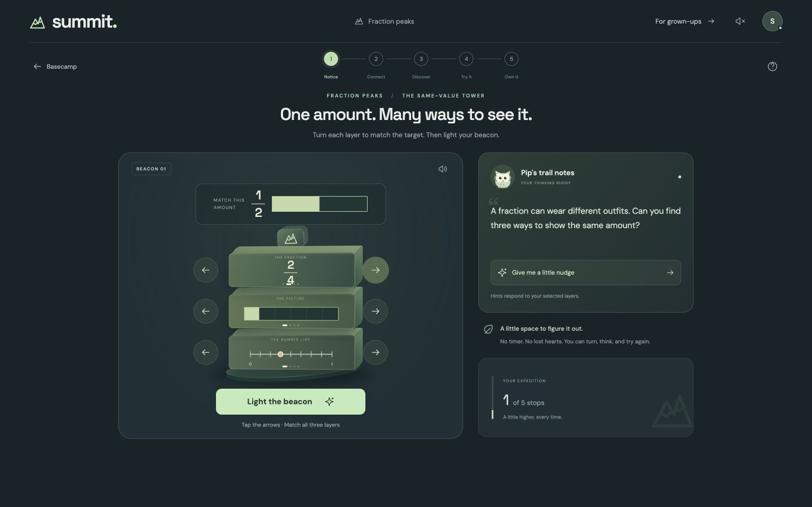

# Summit

**One amount. Many ways to see it.**

In **Fraction Peaks**, turn a fraction symbol, a shaded model, and a number line until they agree. Light the beacon, climb the mountain, and use Pip's visual hints to see why the values match.

[Run locally](#run) · [Walk through the product](docs/PRODUCT-WALKTHROUGH.md) · [Explore the architecture](docs/ARCHITECTURE.md)



**A welcoming way back.** After five days away, an optional comeback step offers arithmetic practice one level lower, keeps the learner's history, and uses an available streak freeze to preserve their streak. Returning becomes a clear next step in the adventure.

## Run

**Node.js 24 or newer is required.** From the repository root:

```sh
npm ci
npm run build
npm start
```

Open **http://127.0.0.1:3001**, choose **Let's climb**, and play. SQLite is built into Node 24; no separate database, account, or AI key is needed. The local server creates the synthetic demo profile automatically.

For development, run `npm run dev` and open **http://127.0.0.1:5174**. The included `.nvmrc` selects Node 24. Keep development dependencies installed: the server runs TypeScript through `tsx`. More setup and API details are in the [server guide](server/README.md).

## A climb worth exploring

- **Fraction Peaks:** three towers connect equivalent fractions across symbols, same-size shaded wholes, and number lines. A subdivision scaffold makes the unchanged amount visible. Two session checks follow.
- **Comeback:** choose a gentler arithmetic starting level after a break. The adjustment never goes below level 1, preserves past results, and can use one available streak freeze.
- **Seven arithmetic trails:** seven distinct questions, three hearts, and a two-minute bonus window. A third incorrect answer ends the round; losing hearts never lowers a practice level. Completing all seven answers with a heart remaining before the window closes earns a 50-point bonus. When the window closes, play continues while hearts remain.
- **Four story worlds:** space, ocean, dinosaurs, and animals turn a single arithmetic problem into a small story. These rounds have no timer or hearts.
- **Field journal:** completed practice, first-attempt checks without hints, and supported work stay distinct. Save or resume a fraction climb and export the session record.
- **Comfort controls:** keyboard and touch controls, optional sound, motion and contrast settings, and browser read-aloud where available. Fraction Peaks stays untimed and heart-free.

The bonus is determined when the last answer is assessed, so taking time to read the results or press Finish does not lose an earned bonus. The [product walkthrough](docs/PRODUCT-WALKTHROUGH.md) explains the flow and the choices behind it.

## Verify

```sh
npm run check:repo
npm test
npm run typecheck
npm run eval
npm run build
```

The **Verify Summit** workflow runs these checks on Node 24. See the [current verification record](docs/QA.md) for results, scenarios, and remaining coverage. These commands check software behavior and content rules; learner outcomes need a separate study.

## AI, evidence, and release scope

Pip's fraction strategies are authored and deterministic. Optional Anthropic calls add arithmetic stories, hints, and parent guidance; code owns answers, hint state, scores, and progression. Story provenance identifies model output or authored fallback. Numeric and format checks bound the output, but cannot establish every story's meaning or suitability.

To try live AI, copy `.env.example` to a private `.env`, add your own `ANTHROPIC_API_KEY`, restart, and enable **For grown-ups → Optional AI features**. AI starts off. Missing access, provider failure, timeout, or rejected output uses authored content. Keep real keys out of Git and browser code; the example model alias is `claude-sonnet-4-5`.

This release runs locally with one synthetic learner. Accounts, guardian verification, shared storage, and protected administration are needed before public multiuser use. Fraction checks repeat across climbs: the journal describes the current session, without claiming lasting mastery. The comeback rule is a product choice whose effect on return behavior and learning has not yet been measured. [Architecture](docs/ARCHITECTURE.md) and [QA](docs/QA.md) describe the practical limits.

## Built with AI, directed by a person

> I built the foundation with Claude, then iterated with Codex. AI coding tools did most of the typing; the product decisions, the thesis, and the review were mine.

The alpine scenery was generated with an AI image tool; the tower, Pip, icons, and mathematical models use SVG/CSS/React. The [development record](docs/DEVELOPMENT-RECORD.md), [AI/material disclosure](docs/DISCLOSURES.md), and [artwork record](docs/ARTWORK.md) make those contributions explicit.

The project uses the [MIT License](LICENSE). Third-party materials retain their own terms; see [licensing](docs/LICENSING.md), the [dependency inventory](docs/DEPENDENCIES.md), and [package notices](docs/materials/THIRD_PARTY_NOTICES.txt). The [challenge guide](docs/HACKATHON.md) keeps submission context separate from the product walkthrough.
