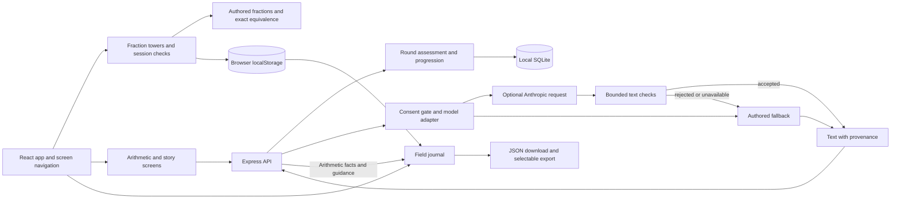

# Summit architecture

Summit is a React/TypeScript browser app with an Express API and local SQLite database. The fraction expedition runs in the browser. Arithmetic assessment is owned by the server. Optional model calls supply short language around code-generated math.

It is a single synthetic learner demonstration, not a production multi-user service.

## Runtime and data flow

During development, Vite serves the browser app and proxies `/api` to Express. After `npm run build`, Express can serve `web/dist` and the API from one process. The default listener is `127.0.0.1:3001`. Node 24 supplies the SQLite driver; no native SQLite add-on build is required.

The browser's screen selection uses React state rather than a URL router. A reload returns to the app entry screen; reopening Fraction Peaks restores its saved active state when available. Standard arithmetic trails keep a browser-local round pointer and retrieve authoritative state from `GET /api/round/:id`, allowing an existing round or interrupted completion to recover without creating a new round.

## Ownership by module

| Module | Responsibility |
| --- | --- |
| [`web/src/App.tsx`](../web/src/App.tsx) | Home, screen navigation, trail/theme entry, preferences, global dialogs |
| [`web/src/TowerGame.tsx`](../web/src/TowerGame.tsx) | Fraction interaction, area/line visuals, scaffold, attempts/help, resume and session persistence |
| [`web/src/fractions.ts`](../web/src/fractions.ts) | Authored tower/check content, exact equivalence, targeted strategies, evidence summary |
| [`web/src/Arithmetic.tsx`](../web/src/Arithmetic.tsx) | Arithmetic/story presentation, answer and hint requests, result display, provenance |
| [`web/src/Reports.tsx`](../web/src/Reports.tsx) | Fraction session summary, arithmetic log, guidance, consent control, evidence export |
| [`web/src/ui.tsx`](../web/src/ui.tsx) | Shared controls, named dialogs, API helper, storage helpers, speech and sound |
| [`server/src/app.ts`](../server/src/app.ts) | Request schemas, routes, consent gate, static serving, error responses |
| [`server/src/rounds.ts`](../server/src/rounds.ts) | Round/problem identity, distinct problems, answer/hint state, hearts, bonus timing, recovery, idempotent completion and scoring |
| [`server/src/skills.ts`](../server/src/skills.ts) | Arithmetic generation, ranges, exact answers, authored story/hint templates |
| [`server/src/progress.ts`](../server/src/progress.ts) | Progression, comeback/streak behavior, seven-day facts from events |
| [`server/src/ai/story.ts`](../server/src/ai/story.ts) | Story/hint/parent prompts, bounded output checks, fallback and provenance |
| [`server/src/ai/adapter.ts`](../server/src/ai/adapter.ts) | Provider interface, stub, Anthropic request, prompt versions, timeout |
| [`server/src/db.ts`](../server/src/db.ts) | SQLite schema, transactions, synthetic profile, demo date and reset |

## Fraction assessment boundary

Fraction values are integer numerator/denominator pairs. Equivalence uses exact `BigInt` cross-products, avoiding floating-point equality. Every tower has three lists of four authored choices. `TowerGame` checks all three against the target; the scaffold changes subdivisions while preserving the displayed amount.

Each evidence record contains an item ID, `tower` or `check` kind, correctness, assistance, and attempts. A check contributes to the independent count only if correct, unassisted, and first attempt. Supported success means help or another attempt was needed. Checks accept one response, while practice towers allow retry.

Active state is stored under `summit.fraction.active`. Completed sessions are appended once per session ID under `summit.fraction.sessions`, retaining the latest 30. Preferences use `summit.preferences`. The journal filters malformed stored session records before presenting them.

These are browser-local records. They can be cleared, blocked, or edited by the browser user, and they are not authoritative assessment records. The same two check items repeat on a later play-through. Session counts therefore do not establish lasting mastery or retention.

## Arithmetic assessment boundary

A normal round selects seven distinct problem prompts from the current skill and level. Selection is seeded and bounded: a future content pool too small to produce seven unique prompts returns an error rather than looping indefinitely or silently repeating questions.

The server stores full problems and sends the client UUIDs and presentation data without the answer. `POST /api/answer` accepts only a problem ID and integer answer. The stored answer is authoritative; a transaction records the result and progress together. Replayed requests return the original result, even if the submitted answer changes.

Requesting a hint marks the stored problem as assisted **before** waiting for a model response. A simultaneous answer cannot bypass that flag. Answered problems cannot request another hint.

Standard trails store their rules when created: seven problems, three hearts, a 120-second bonus window, and a possible 50-point bonus. Each wrong answer spends one heart. The third wrong answer ends the round, including when it happens on the seventh question. After a round ends, new answers and hints are rejected; a replayed answer returns the original assessment.

An unhinted correct answer earns 100 points, a hinted correct answer 60, and an incorrect answer zero. A hint alone does not spend a heart. Completing all seven problems with a heart remaining before the bonus deadline adds 50 points. Expiry alone never ends the round or rejects an answer. The bonus uses the terminal assessment timestamp, not the later Finish click, and the window continues during time away or reload.

`POST /api/round/finish` accepts a terminal round: all problems answered or hearts exhausted. It rejects a still-open round and computes results from saved assessments. Repeated finish requests return the original completion without another award. Elapsed seconds use start-to-terminal-assessment wall time, capped at one hour; idle time is included, so this is not attention time. Waiting on the results screen does not change an earned bonus.

Three consecutive correct unhinted answers at the currently assessed difficulty unlock the next game level. Easier questions remaining in an already-started round cannot keep unlocking higher levels. A hint or incorrect answer resets the consecutive-answer run. These are game progression rules, not validated mastery criteria.

The database stores learners, skill progress, events, rounds, problems, and demo settings. Arithmetic answers and round completion feed the seven-day journal facts. A story uses a one-problem round without heart or timing rules. Saved rounds from before the trail-rules migration retain their original untimed, heart-free behavior.

### Comeback is a separate choice

After five days away, the optional comeback action lowers each arithmetic practice level by one, with level 1 as the floor, and clears the consecutive-answer run. Historical records remain. An available streak freeze preserves the daily streak once; without one, the comeback resets the streak. Losing hearts never invokes this action or lowers a level. These rules define a return path; they are not evidence of a measured retention benefit.

The synthetic profile uses a stored demonstration date, initialized when seeded. `POST /api/clock/advance` advances that date to make a return scenario reproducible; it does not change the real-time arithmetic bonus clock. Label use of the demonstration clock when showing comeback.

## AI boundary and failure paths

All exposed story, hint, and parent-note routes choose their adapter through the server's consent gate. The seeded setting is off. Without consent or a configured key, the stub produces authored fallback. The grown-up switch demonstrates consent state but does not verify identity.

The Anthropic adapter uses an eight-second abort signal and returns no model text on provider/parse/network failure. Code then selects authored content. The real elapsed abort timing was not directly measured during the recorded smoke test.

For a story, code first selects the skill, operation, operands, and answer. The model receives operation, operands, theme, and grade—not a learner name. Accepted story text must pass six checks: response present, required digit operands present, no additional digit numbers, no answer digit leak with operand-equality exceptions, at most 40 words, and valid generated arithmetic/range. Place-value problems have an operand-presence exception.

Hints have bounded number/length checks; parent notes have presence, no-digit, and length checks. Parent counts are rendered from computed facts, separately from the note. Names can appear in a local authored parent fallback but are not sent in the model prompt.

Each response carries provider, prompt version, field names sent, validation results, and final source. The UI labels accepted AI and offline content accordingly. **Accepted after checks does not mean fully validated:** these constraints do not establish that every sentence implies the correct operation, catch every written-out answer, ensure suitability, or prove learning outcomes. Aggregate latency, costs, fallback rates, and semantic quality are not yet an evaluation dashboard.

## API surface

| Route | Purpose |
| --- | --- |
| `GET /api/home`, `GET /api/health` | Demo profile, progression, effective provider and availability |
| `POST /api/round` | Create an arithmetic round for a known skill |
| `GET /api/round/:id` | Recover current round state, assessments, hint status, and any stored completion |
| `POST /api/answer` | Assess one stored problem |
| `POST /api/hint` | Mark assistance and return checked or authored guidance |
| `POST /api/round/finish` | Collect a round completed by answering every problem or exhausting its hearts |
| `POST /api/story` | Create a themed one-problem round, subject to rollout |
| `GET /api/parent` | Computed arithmetic facts and separate guidance/provenance |
| `POST /api/settings/ai-consent` | Change the demo consent setting |
| `POST /api/comeback/apply` | Apply the existing optional comeback behavior |

Strict request schemas constrain mutation payloads and the JSON body limit is 16 KB. These are input protections, not authentication. The demo also exposes event inspection, clock advance, and reset routes; they are unauthenticated and must be removed or restricted before any public multi-user deployment. The rollout flag deterministically buckets the one seeded learner; it is not evidence of an actual cohort experiment.

## Journal and storage limits

The report combines two sources for presentation without pretending they share an account system:

- Latest completed fraction-session metrics and stored sessions come from this browser.
- Arithmetic facts and optional parent guidance come from this local server.
- The JSON export includes both when available, plus guidance provenance. An unavailable arithmetic report is represented by null facts in the export.

The export action prepares a Blob download and displays the same JSON in a selectable dialog. The dialog was verified; external-browser file saving was not independently verified. There is no synchronization, authentication, tenant isolation, verified guardian workflow, or production rate limiting. Clearing local browser storage and resetting the server affect different records.

## Verification and remaining work

The [verification record](QA.md) holds the current test totals, deterministic evaluation, type/build results, browser scenarios, and remaining coverage. Run the [verification commands](../README.md#verify) against the current release. Check the assessment, hearts/bonus, recovery, consent/fallback, content-integrity, and evidence-summary scenarios there rather than treating an earlier test count as current. Individual successful live model calls do not establish overall reliability.

Priorities are customer discovery, alternate fraction content and measurement, evaluating the effect of comeback and trail challenge, semantic/suitability evaluation of model language, and identity/storage/administrative boundaries before real deployment. The [product walkthrough](PRODUCT-WALKTHROUGH.md) explains the decisions and proposed metrics. The [disclosure](DISCLOSURES.md) identifies the Claude-assisted foundation and subsequent Codex iteration.
